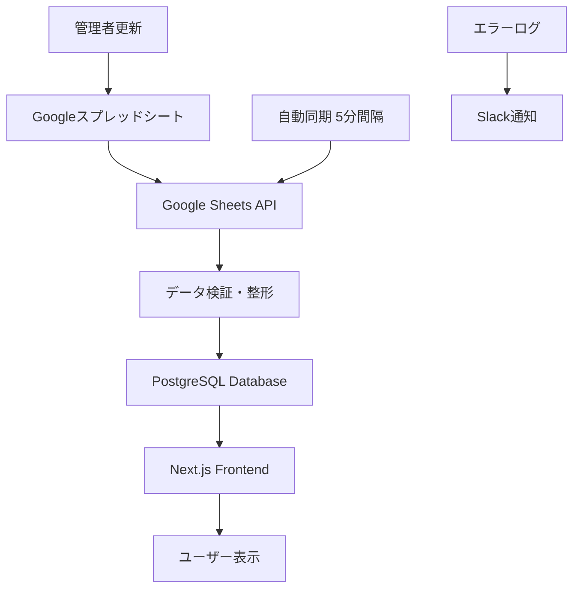
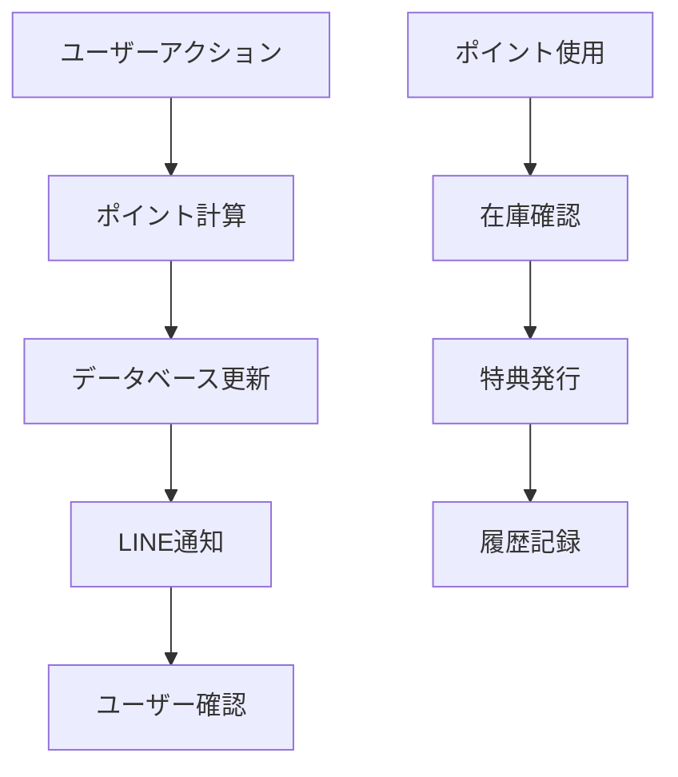

# Jiji V2.8 API統合・システム構成提案

## 🎯 推奨システム構成

### **フロントエンド: Next.js 14**
```bash
# 技術スタック
- Framework: Next.js 14 (App Router)
- UI: Tailwind CSS + shadcn/ui
- State Management: Zustand
- Authentication: NextAuth.js
- Payment: Stripe
- Analytics: Vercel Analytics
```

### **バックエンド: Strapi CMS**
```bash
# 管理機能
- 会員管理 (User Management)
- ショップ管理 (Shop Management)  
- ブログ管理 (Content Management)
- ポイントシステム (Custom Plugin)
- 口コミ管理 (Review System)
- 決済管理 (Payment Integration)
```

### **データベース: PostgreSQL**
```sql
-- 主要テーブル設計
Users (会員情報)
Shops (ショップ情報) 
Reviews (口コミ)
Points (ポイント履歴)
Subscriptions (サブスクリプション)
Blog_Posts (ブログ投稿)
Weather_Data (海況データ)
```

## 🔗 Google API連携実装

### **1. Google Sheets API - ショップデータ管理**
```javascript
// 実装機能
- リアルタイムショップ情報同期
- 自動データ検証・整形
- 管理者フレンドリーな更新インターフェース
- バックアップ・履歴管理

// API設定
const GOOGLE_SHEETS_CONFIG = {
  spreadsheetId: 'YOUR_SPREADSHEET_ID',
  range: 'ショップリスト!A:Z',
  updateInterval: 300000, // 5分ごと
  validationRules: {
    required: ['shop_name', 'area', 'phone'],
    optional: ['rating', 'specialties', 'price_range']
  }
}
```

### **2. Google Maps API - 位置情報・地図機能**
```javascript
// 実装機能
- ショップ位置の地図表示
- 距離計算・ルート検索
- 周辺施設情報
- ストリートビュー統合

// API設定
const GOOGLE_MAPS_CONFIG = {
  apiKey: 'YOUR_MAPS_API_KEY',
  libraries: ['places', 'geometry', 'drawing'],
  region: 'JP',
  language: 'ja'
}
```

### **3. Google Analytics 4 - 行動分析**
```javascript
// 実装機能
- ユーザー行動追跡
- コンバージョン分析
- カスタムイベント計測
- レポート自動生成

// トラッキングイベント
- shop_search
- shop_view
- review_post
- line_bot_interaction
- point_earned
- subscription_purchased
```

## 🗂️ データ管理フロー

### **ショップデータ管理フロー**


### **ポイントシステムフロー**


## 💰 収益化システム統合

### **Stripe決済システム**
```javascript
// サブスクリプション管理
const SUBSCRIPTION_PLANS = {
  basic: { price: 0, features: ['基本機能'] },
  standard: { price: 3000, features: ['基本機能', '広告表示'] },
  premium: { price: 5000, features: ['全機能', '優先表示', '分析レポート'] }
}

// 実装機能
- 月額課金自動処理
- 請求書自動発行
- 支払い失敗時の自動対応
- 解約・プラン変更処理
```

## 🔄 段階的移行計画

### **フェーズ1: 基盤構築 (2-3週間)**
```bash
# 実装項目
✅ Next.js プロジェクト初期化
✅ Strapi CMS セットアップ
✅ PostgreSQL データベース構築
✅ 基本認証システム
✅ Google Sheets API 連携
```

### **フェーズ2: 機能移行 (3-4週間)**
```bash
# 実装項目
✅ 既存HTMLページのNext.js移行
✅ 会員システム実装
✅ ショップ管理システム
✅ 口コミシステム
✅ ポイントシステム
```

### **フェーズ3: 高度機能 (2-3週間)**
```bash
# 実装項目
✅ 決済システム統合
✅ 分析ダッシュボード
✅ LINE Bot統合
✅ 海況データAPI
✅ 管理者ダッシュボード
```

## 📋 管理システム比較

### **WordPress vs Strapi vs カスタム開発**

| 機能 | WordPress | Strapi | カスタム開発 |
|------|-----------|---------|-------------|
| 会員管理 | ⚠️ プラグイン依存 | ✅ 標準機能 | ✅ 完全カスタム |
| ポイントシステム | ❌ 限定的 | ✅ カスタム可能 | ✅ 完全自由 |
| API連携 | ⚠️ 制限あり | ✅ 柔軟 | ✅ 完全自由 |
| 管理画面 | ✅ 使いやすい | ✅ 直感的 | ⚠️ 開発必要 |
| パフォーマンス | ❌ 重い | ✅ 高速 | ✅ 最適化可能 |
| 拡張性 | ⚠️ 限定的 | ✅ 高い | ✅ 無限 |
| 開発コスト | ✅ 低い | ⚠️ 中程度 | ❌ 高い |

**結論: Strapi + Next.js が最適解**

## 🛠️ 技術実装詳細

### **Google Sheets API連携コード例**
```javascript
// lib/google-sheets.js
import { GoogleSpreadsheet } from 'google-spreadsheet';

export class ShopDataManager {
  constructor() {
    this.doc = new GoogleSpreadsheet(process.env.GOOGLE_SPREADSHEET_ID);
    this.sheet = null;
  }

  async initialize() {
    await this.doc.useServiceAccountAuth({
      client_email: process.env.GOOGLE_SERVICE_ACCOUNT_EMAIL,
      private_key: process.env.GOOGLE_PRIVATE_KEY.replace(/\\n/g, '\n'),
    });
    
    await this.doc.loadInfo();
    this.sheet = this.doc.sheetsByIndex[0];
  }

  async syncShopData() {
    const rows = await this.sheet.getRows();
    const shopData = rows.map(row => ({
      id: row.shop_id,
      name: row.shop_name,
      area: row.area,
      phone: row.phone,
      rating: parseFloat(row.rating) || 0,
      specialties: row.specialties?.split(',') || [],
      priceRange: row.price_range,
      updatedAt: new Date()
    }));

    // データベースに保存
    await this.saveToDatabase(shopData);
    return shopData;
  }

  async saveToDatabase(shopData) {
    // PostgreSQL保存処理
    for (const shop of shopData) {
      await prisma.shop.upsert({
        where: { id: shop.id },
        update: shop,
        create: shop
      });
    }
  }
}
```

### **ポイントシステム実装例**
```javascript
// lib/point-system.js
export class PointSystem {
  static POINT_RULES = {
    REVIEW_POST: 100,
    PHOTO_UPLOAD: 50,
    REFERRAL: 500,
    MONTHLY_BONUS: 200
  };

  static async awardPoints(userId, action, metadata = {}) {
    const points = this.POINT_RULES[action] || 0;
    
    if (points > 0) {
      await prisma.pointHistory.create({
        data: {
          userId,
          points,
          action,
          metadata,
          createdAt: new Date()
        }
      });

      // LINE通知
      await this.sendLineNotification(userId, points, action);
    }
  }

  static async sendLineNotification(userId, points, action) {
    const user = await prisma.user.findUnique({ where: { id: userId } });
    if (user.lineUserId) {
      await lineBot.pushMessage(user.lineUserId, {
        type: 'text',
        text: `${points}ポイントを獲得しました！\n理由: ${action}`
      });
    }
  }
}
```

## 🚀 デプロイメント推奨環境

### **本番環境**
```bash
# フロントエンド
Platform: Vercel (Next.js最適化)
CDN: Vercel Edge Network
Analytics: Vercel Analytics

# バックエンド
Platform: Railway or DigitalOcean
Database: PostgreSQL (Supabase or AWS RDS)
CMS: Strapi (self-hosted)
Files: AWS S3 or Cloudinary

# 監視
Monitoring: Sentry
Logs: LogRocket
Uptime: Pingdom
```

### **費用概算 (月額)**
```bash
# 基本構成
Vercel Pro: $20
PostgreSQL: $15-30
Strapi Hosting: $10-20
Google APIs: $5-15
Stripe: 3.4% + 手数料
監視ツール: $10-20

合計: $60-105/月 (取引量により変動)
```

## 📈 成長対応

### **トラフィック増加対応**
- CDN配信による高速化
- データベースレプリケーション
- API Rate Limiting
- 画像最適化・圧縮

### **機能拡張対応**
- マイクロサービス化準備
- API Gateway導入
- キャッシュ層強化
- 監視・アラート強化

この構成により、現在の要件を満たしながら将来的な拡張にも対応可能なシステムを構築できます。