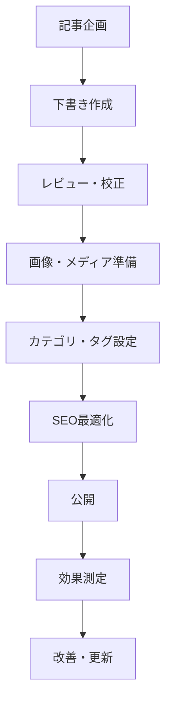

# 📝 Dive Buddy's ブログシステム管理ガイド

**作成日**: 2025年7月26日  
**バージョン**: v1.0  
**対象**: ブログ管理者・コンテンツ作成者  

---

## 🎯 **目次**

1. [ブログシステム概要](#ブログシステム概要)
2. [API操作方法](#api操作方法)
3. [記事の書き方ガイド](#記事の書き方ガイド)
4. [カテゴリ・タグ管理](#カテゴリタグ管理)
5. [記事管理フロー](#記事管理フロー)
6. [SEO最適化ガイド](#seo最適化ガイド)
7. [トラブルシューティング](#トラブルシューティング)

---

## 📖 **ブログシステム概要**

### **システム構成**
```
Dive Buddy's ブログシステム
├── BlogAPIService (src/blog-api.js)
├── 7つのカテゴリ（沖縄ダイビング特化）
├── 32のタグシステム
├── 6つのAPIエンドポイント
└── サンプル記事（6件）
```

### **対応コンテンツ**
- **ダイビングスポット情報** 🐠
- **海洋生物ガイド** 🐢  
- **旅行Tips・実用情報** ✈️
- **器材・装備ガイド** ⚙️
- **初心者向けガイド** 🔰
- **季節・時期情報** 🌺
- **ショップ・サービス情報** 🏪

---

## 🔌 **API操作方法**

### **1. 記事一覧取得**
```bash
# 基本取得
curl "http://localhost:3000/api/blog/articles"

# カテゴリフィルター
curl "http://localhost:3000/api/blog/articles?category=diving_spots"

# タグフィルター
curl "http://localhost:3000/api/blog/articles?tags=石垣島,マンタ"

# 検索
curl "http://localhost:3000/api/blog/articles?search=初心者"

# ページネーション
curl "http://localhost:3000/api/blog/articles?limit=10&offset=0"

# ソート
curl "http://localhost:3000/api/blog/articles?sortBy=published_at&sortOrder=desc"
```

### **2. 記事詳細取得**
```bash
# 記事詳細（関連記事付き）
curl "http://localhost:3000/api/blog/articles/article_001"
```

### **3. カテゴリ・タグ情報**
```bash
# カテゴリ統計
curl "http://localhost:3000/api/blog/categories/stats"

# タグクラウド
curl "http://localhost:3000/api/blog/tags"
```

### **4. 人気・最新記事**
```bash
# 人気記事（上位10件）
curl "http://localhost:3000/api/blog/popular?limit=10"

# 最新記事（5件）
curl "http://localhost:3000/api/blog/latest?limit=5"
```

### **5. システム統計**
```bash
# ブログ全体統計
curl "http://localhost:3000/api/blog/statistics"
```

---

## ✍️ **記事の書き方ガイド**

### **記事データ構造**
```javascript
{
  id: 'article_001',                    // 一意のID
  title: '石垣島のマンタポイント完全ガイド',  // タイトル
  slug: 'ishigaki-manta-guide',         // URL用スラッグ
  excerpt: '石垣島の代表的なダイビング...',  // 抜粋（150文字程度）
  content: 'マンタとの遭遇は多くの...',     // 本文
  category: 'diving_spots',             // カテゴリID
  tags: ['石垣島', 'マンタ', 'ボート'],    // タグ配列
  author: 'Jiji編集部',                 // 著者名
  featured_image: '/images/blog/manta.jpg', // アイキャッチ画像
  published_at: '2025-07-25T10:00:00Z', // 公開日時
  status: 'published',                  // ステータス
  featured: true                        // 注目記事フラグ
}
```

### **記事作成手順**

#### **Step 1: 企画・構成**
1. **ターゲット読者の設定**
   - 初心者ダイバー
   - 経験者・上級者
   - 沖縄旅行予定者
   - ダイビングショップ利用者

2. **コンテンツの目的**
   - 情報提供
   - 問題解決
   - 体験・感動の共有
   - 安全性の向上

#### **Step 2: タイトル・構成決定**
```markdown
✅ 良いタイトル例：
- 「石垣島のマンタポイント完全ガイド」
- 「初心者必見！沖縄ダイビングの基礎知識」
- 「宮古島の地形ダイビング：魔王の宮殿」

❌ 避けるべきタイトル：
- 「ダイビングについて」（曖昧）
- 「海がきれい」（情報不足）
- 「おすすめスポット」（具体性なし）
```

#### **Step 3: カテゴリ・タグ選択**

**カテゴリ一覧**：
```javascript
{
  diving_spots: 'ダイビングスポット',     // スポット情報
  marine_life: '海洋生物',              // 生物ガイド
  travel_tips: '旅行Tips',              // 実用情報
  equipment: '器材・装備',              // 器材関連
  beginner_guide: '初心者ガイド',        // 基礎知識
  seasonal_info: '季節情報',            // 時期別情報
  shop_review: 'ショップ情報'           // ショップ関連
}
```

**タグ選択ガイド**：
```javascript
// エリア系（必須）
['石垣島', '宮古島', '沖縄本島', '久米島', '西表島', '与那国島', '慶良間諸島']

// ダイビング種別
['体験ダイビング', 'ファンダイビング', 'ライセンス取得', 'アドバンス']

// 海洋生物
['マンタ', 'ウミガメ', 'クマノミ', 'ジンベエザメ', 'ハンマーヘッド']

// スタイル
['ボートダイビング', 'ビーチダイビング', '洞窟ダイビング', '地形ダイビング']

// レベル
['初心者', '中級者', '上級者', 'インストラクター']

// その他
['水中写真', '安全', 'お得情報', '最新情報']
```

#### **Step 4: 本文作成**

**記事構成テンプレート**：

```markdown
# タイトル

## 導入（なぜこの記事を書くのか）
- 読者の悩み・疑問に共感
- 記事で得られる価値を明示

## 基本情報（必要に応じて）
- 場所・アクセス
- 料金・時間
- 必要レベル・資格

## メインコンテンツ
### ポイント1：○○について
### ポイント2：○○の方法
### ポイント3：注意点・コツ

## 実体験・具体例
- 実際の体験談
- 写真・画像の説明
- 数値データ

## まとめ・次のアクション
- 要点の再確認
- 読者がすべき次の行動
- 関連記事への誘導
```

**記事の質を高めるコツ**：

1. **具体性を重視**
   ```markdown
   ❌ 「深い場所にいます」
   ✅ 「水深15-30mの範囲でよく見られます」
   
   ❌ 「料金は安いです」
   ✅ 「体験ダイビング1本8,000円〜」
   ```

2. **安全性を最優先**
   ```markdown
   ✅ 必ず含める内容：
   - 経験レベルの目安
   - 注意事項・リスク
   - インストラクターの重要性
   - 天候・海況への配慮
   ```

3. **読者目線で執筆**
   ```markdown
   ✅ 読者が知りたい情報：
   - How（どうやって）
   - What（何が）
   - Where（どこで）
   - When（いつ）
   - Why（なぜ）
   - How much（いくら）
   ```

---

## 🏷️ **カテゴリ・タグ管理**

### **カテゴリ使い分けガイド**

#### **1. diving_spots（ダイビングスポット）🐠**
```markdown
対象記事：
- 特定ポイントの詳細情報
- ポイント攻略法
- アクセス方法
- 見どころ解説

例：「石垣島マンタポイント完全ガイド」
```

#### **2. marine_life（海洋生物）🐢**
```markdown
対象記事：
- 生物の生態解説
- 観察のコツ
- 撮影方法
- 季節・時期情報

例：「沖縄で出会える海洋生物図鑑」
```

#### **3. travel_tips（旅行Tips）✈️**
```markdown
対象記事：
- 旅行計画の立て方
- 交通・宿泊情報
- 予算・費用
- 持ち物・準備

例：「沖縄ダイビング旅行の完全プランニング」
```

#### **4. equipment（器材・装備）⚙️**
```markdown
対象記事：
- 器材選びのコツ
- メンテナンス方法
- 購入・レンタル情報
- 新製品レビュー

例：「ダイビング器材のメンテナンス方法」
```

#### **5. beginner_guide（初心者ガイド）🔰**
```markdown
対象記事：
- ダイビングの基礎知識
- ライセンス取得方法
- 安全に関する情報
- 不安解消

例：「初心者必見！沖縄ダイビングの基礎知識」
```

#### **6. seasonal_info（季節情報）🌺**
```markdown
対象記事：
- 季節別の海況情報
- 時期ごとの見どころ
- 台風・天候情報
- ベストシーズン案内

例：「夏の沖縄ダイビング：台風シーズン対策」
```

#### **7. shop_review（ショップ情報）🏪**
```markdown
対象記事：
- ショップレビュー
- サービス紹介
- スタッフインタビュー
- 特別プラン紹介

例：「石垣島おすすめダイビングショップ5選」
```

### **タグ付けのベストプラクティス**

1. **エリアタグは必須**
   ```javascript
   // 記事に関連するエリアは必ず含める
   tags: ['石垣島', 'マンタ', 'ボートダイビング']
   ```

2. **レベル別タグを活用**
   ```javascript
   // 読者のレベルを明確に
   tags: ['初心者', '体験ダイビング', '安全']
   ```

3. **3-6個程度に絞る**
   ```javascript
   ✅ 適切：['石垣島', 'マンタ', 'ボートダイビング', '中級者']
   ❌ 多すぎ：['石垣島', 'マンタ', 'ボート', '海', '魚', '沖縄', '旅行', '観光', 'ダイビング']
   ```

---

## 📋 **記事管理フロー**

### **記事作成〜公開の流れ**



### **記事ステータス管理**

```javascript
記事ステータス：
- 'draft'      // 下書き
- 'review'     // レビュー中
- 'scheduled'  // 公開予約
- 'published'  // 公開済み
- 'archived'   // アーカイブ
```

### **品質チェックリスト**

#### **必須チェック項目**
- [ ] タイトルが魅力的で具体的
- [ ] 抜粋が150文字程度で内容を要約
- [ ] カテゴリが適切に設定
- [ ] タグが3-6個で関連性高い
- [ ] 本文が1500文字以上
- [ ] 安全に関する注意点を記載
- [ ] 誤字脱字チェック完了
- [ ] 画像の著作権クリア

#### **推奨チェック項目**
- [ ] 実体験・具体例を含む
- [ ] 数値データで信頼性向上
- [ ] 関連記事への内部リンク
- [ ] CTA（行動喚起）を含む
- [ ] モバイル表示確認
- [ ] ページ表示速度確認

---

## 🔍 **SEO最適化ガイド**

### **タイトル最適化**
```markdown
✅ 効果的なタイトル構成：
- [エリア名] + [内容] + [ベネフィット]
- 例：「石垣島マンタポイント完全ガイド｜遭遇率90%の攻略法」

❌ 避けるべき：
- 32文字以上の長すぎるタイトル
- 抽象的すぎる表現
- キーワードの詰め込みすぎ
```

### **メタディスクリプション**
```markdown
抜粋（excerpt）の書き方：
- 120-150文字程度
- 記事の価値を明確に
- 行動を促す表現

例：「石垣島の代表的なダイビングスポット、マンタポイントの攻略法を詳しく解説。遭遇率90%以上の実績あるポイントと最適な時期をご紹介します。」
```

### **キーワード戦略**
```javascript
// 主要キーワード例
const keywords = {
  primary: ['沖縄 ダイビング', '石垣島 マンタ', '宮古島 地形'],
  secondary: ['体験ダイビング', 'ライセンス取得', 'ダイビングショップ'],
  long_tail: ['石垣島 マンタポイント 攻略法', '沖縄 初心者 ダイビング おすすめ']
};
```

### **内部リンク戦略**
```markdown
関連記事への適切なリンク：
- 同じカテゴリの記事
- 同じエリアの記事
- レベル別の記事
- 関連する器材・装備記事

例：
「マンタ遭遇のコツについては、[ダイビング器材のメンテナンス方法](link)も参考にしてください。」
```

---

## 🛠️ **トラブルシューティング**

### **よくある問題と解決法**

#### **1. APIエラー**
```bash
# エラー確認方法
curl -s "http://localhost:3000/api/blog/articles" | jq '.error'

# サーバー再起動
pkill -f "node app.js"
node app.js &
```

#### **2. 記事が見つからない**
```javascript
// 記事IDの確認
curl "http://localhost:3000/api/blog/articles" | jq '.data.articles[].id'

// 存在する記事IDを使用
curl "http://localhost:3000/api/blog/articles/article_001"
```

#### **3. カテゴリ・タグが反映されない**
```javascript
// 利用可能なカテゴリ確認
curl "http://localhost:3000/api/blog/categories/stats" | jq '.data.categoryStats'

// 利用可能なタグ確認
curl "http://localhost:3000/api/blog/tags" | jq '.data.tags[].tag'
```

### **パフォーマンス改善**

1. **画像最適化**
   - WebP形式の使用
   - 適切なサイズ（幅800px程度）
   - 圧縮率80-90%

2. **コンテンツ最適化**
   - 適切な見出し構造（H2, H3）
   - 段落の長さ調整
   - 箇条書きの活用

3. **ページ表示速度**
   - 不要なスクリプト削除
   - CSS/JS圧縮
   - CDN活用

---

## 📊 **成果測定・分析**

### **重要な指標**

1. **記事パフォーマンス**
   ```javascript
   // 人気記事確認
   curl "http://localhost:3000/api/blog/popular?limit=10"
   
   // カテゴリ別記事数
   curl "http://localhost:3000/api/blog/categories/stats"
   ```

2. **検索・フィルター利用状況**
   - カテゴリフィルター使用率
   - タグフィルター使用率
   - 検索キーワード分析

3. **ユーザー行動**
   - 記事詳細ページ閲覧数
   - 関連記事クリック率
   - 滞在時間

### **改善のヒント**

1. **人気記事の分析**
   - どんなテーマが人気か
   - どのエリアの情報が求められているか
   - どのレベルの読者が多いか

2. **コンテンツギャップの発見**
   - 検索されているが記事がないキーワード
   - アクセスの少ないカテゴリ
   - 季節性のあるコンテンツ需要

---

## 📝 **今後の拡張予定**

### **Phase 2 予定機能**
- [ ] 記事投稿UI（管理画面）
- [ ] 画像アップロード機能
- [ ] コメント・評価システム
- [ ] SNS連携機能
- [ ] 記事下書き保存
- [ ] 公開予約機能

### **Phase 3 予定機能**
- [ ] 多言語対応
- [ ] 検索機能強化
- [ ] レコメンド機能
- [ ] アナリティクス連携
- [ ] SEO自動最適化
- [ ] AMP対応

---

## 📞 **サポート・問い合わせ**

### **技術的な問題**
- API仕様書：本ドキュメント参照
- ログ確認：サーバーコンソール
- エラーレポート：issue作成

### **コンテンツ相談**
- 記事企画相談
- SEO戦略相談
- カテゴリ・タグ体系見直し

---

**🌊 このガイドラインに従って、質の高い沖縄ダイビング情報コンテンツを作成していきましょう！**