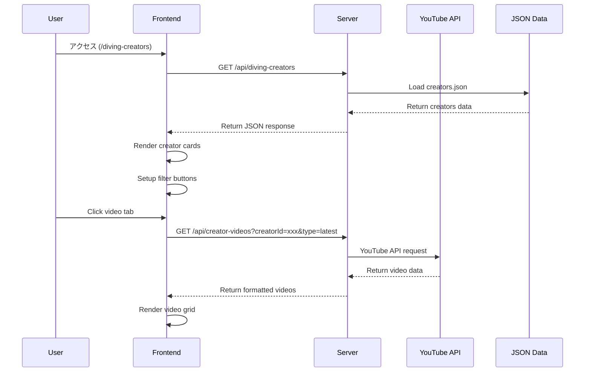

# ダイビングクリエイター紹介システム 技術仕様書 v1.0

**作成日**: 2025年8月10日  
**対象システム**: Dive Buddy's ダイビングクリエイター紹介機能  
**バージョン**: 1.0

## 📋 システム概要

### **目的**
ダイビング愛好家向けに、技術解説・海中撮影・旅行情報を提供するクリエイターを統合的に紹介し、YouTube動画との連携によってリアルタイムなコンテンツ配信を実現する。

### **対象ユーザー**
- ダイビング初心者〜上級者
- 水中撮影愛好家  
- 沖縄・離島ダイビング旅行計画者
- ダイビングプロ養成志向者

## 🏗️ システム構成

### **アーキテクチャ図**
```
┌─────────────────┐    ┌──────────────────┐    ┌─────────────────┐
│   Frontend UI   │◄──►│   Express.js     │◄──►│  YouTube API    │
│  (Vanilla JS)   │    │   Server         │    │     v3          │
└─────────────────┘    └──────────────────┘    └─────────────────┘
         │                        │                        │
         │                        ▼                        │
         │              ┌──────────────────┐               │
         │              │   Static JSON    │               │
         └──────────────│      Data        │               │
                        │  (Creators DB)   │               │
                        └──────────────────┘               │
                                 │                         │
                                 ▼                         │
                        ┌──────────────────┐               │
                        │ Supabase/Rails   │◄──────────────┘
                        │   Production     │
                        └──────────────────┘
```

## 🎯 機能仕様

### **1. クリエイター一覧表示**

#### **表示項目**
| 項目 | データ型 | 必須 | 説明 |
|------|----------|------|------|
| id | string | ✅ | 一意識別子 |
| name | string | ✅ | クリエイター名 |
| channelHandle | string | ✅ | @ハンドル名 |
| channelId | string | ✅ | プラットフォームID |
| platform | enum | ✅ | youtube/instagram |
| subscriberCount | number | ✅ | 登録者数 |
| videoCount/postCount | number | ✅ | コンテンツ数 |
| specialties | array | ✅ | 専門分野タグ |
| targetAudience | string | ✅ | 対象ユーザー層 |
| region | string | ✅ | 活動地域 |
| description | string | ✅ | 説明文 |

#### **フィルタリング機能**
```javascript
// 8カテゴリーフィルタリング実装
const categories = [
  'beginner_friendly',    // 初心者向け
  'technical_diving',     // テクニカルダイビング  
  'marine_life',         // 海中生物
  'equipment_review',    // 器材レビュー
  'underwater_photography', // 水中撮影
  'professional_training',  // プロ養成
  'regional_guide',      // 地域ガイド
  'travel_deals'         // 旅行・セール情報
];
```

### **2. YouTube動画統合**

#### **API仕様**
```javascript
// 最新動画取得
GET /api/creator-videos?creatorId={id}&type=latest&maxResults=5

// 人気動画取得  
GET /api/creator-videos?creatorId={id}&type=popular&maxResults=3

// レスポンス形式
{
  "success": boolean,
  "creatorId": string,
  "creatorName": string,
  "type": "latest"|"popular",
  "videos": [
    {
      "videoId": string,
      "title": string,
      "description": string,
      "publishedAt": string (ISO8601),
      "thumbnail": string (URL),
      "url": string,
      "viewCount": number (optional)
    }
  ]
}
```

#### **YouTube Data API v3 統合**
```javascript
class YouTubeAPI {
  constructor() {
    this.apiKey = process.env.YOUTUBE_API_KEY;
    this.baseURL = 'https://www.googleapis.com/youtube/v3';
  }

  async getLatestVideos(channelId, maxResults = 3) {
    const response = await axios.get(`${this.baseURL}/search`, {
      params: {
        part: 'snippet',
        channelId: channelId,
        maxResults: maxResults,
        order: 'date',
        type: 'video',
        key: this.apiKey
      },
      headers: {
        'Referer': 'https://dive-buddys.com'
      }
    });
    // ... data processing
  }
}
```

## 📁 ファイル構成

```
/src
├── youtube-api.js              # YouTube API統合クラス
└── server.js                  # APIエンドポイント実装

/data  
├── diving-creators.json       # クリエイターマスターデータ
└── okinawa-councils-cooperatives.json # 協議会情報

/public
└── diving-creators/
    └── index.html             # フロントエンドUI

/docs
├── task_completion_record_v2.0.md    # 作業記録
├── diving_creators_system_spec_v1.0.md # 本仕様書
└── YOUTUBE_API_SETUP.md       # API設定手順
```

## 🎨 UI/UX 仕様

### **デザインシステム**
```css
/* Design Tokens使用 */
:root {
  --color-primary: #2563eb;
  --color-primary-dark: #1d4ed8;
  --spacing-4: 1rem;
  --border-radius-lg: 0.5rem;
  --shadow-lg: 0 10px 15px -3px rgba(0, 0, 0, 0.1);
  --transition-base: all 0.2s ease-in-out;
}
```

### **レスポンシブブレークポイント**
```css
/* モバイル: ~768px */
@media (max-width: 768px) {
  .creators-hero h1 { font-size: var(--font-size-3xl); }
  .creator-info { flex-direction: column; }
  .videos-grid { grid-template-columns: 1fr; }
}

/* タブレット: 769px~1024px */
/* デスクトップ: 1025px~ */
```

### **コンポーネント構造**
```html
<!-- Creator Card Component -->
<div class="creator-card" data-creator-id="{id}">
  <div class="creator-header">
    <div class="creator-info">
      
      <div class="creator-details">
        <h3>{name}</h3>
        <div class="creator-stats">
          <span><i class="fas fa-users"></i> {subscriberCount}</span>
          <span><i class="fas fa-video"></i> {videoCount}</span>
          <span><i class="fas fa-map-marker-alt"></i> {region}</span>
        </div>
      </div>
    </div>
  </div>
  
  <div class="creator-description">{description}</div>
  
  <div class="creator-tags">
    <!-- specialty tags -->
  </div>
  
  <div class="videos-section">
    <div class="videos-tabs">
      <button class="video-tab active" data-tab="latest">最新動画</button>
      <button class="video-tab" data-tab="popular">人気動画ベスト3</button>
    </div>
    <div class="videos-content" id="videos-{id}">
      <!-- dynamic video content -->
    </div>
  </div>
</div>
```

## 🔐 セキュリティ仕様

### **API キー管理**
```javascript
// 環境変数 + フォールバック設定
this.apiKey = process.env.YOUTUBE_API_KEY || '[REDACTED_GOOGLE_API_KEY]';

// Google Cloud Console HTTP Referer制限
const allowedReferrers = [
  'https://dive-buddys.com/*',
  'https://www.dive-buddys.com/*', 
  'http://localhost:3000/*',
  'https://jiji-diving-bot-production.up.railway.app/*'
];
```

### **エラーハンドリング**
```javascript
// APIエラー処理
try {
  const response = await youtube.getLatestVideos(channelId, 5);
} catch (error) {
  console.error('YouTube API Error:', error.message);
  
  // ユーザーフレンドリーなエラー表示
  container.innerHTML = `
    <div class="error-message">
      動画情報の読み込みに失敗しました。
    </div>
  `;
}
```

## 📊 パフォーマンス仕様

### **API使用量最適化**
```javascript
// YouTube API Quota管理
const DAILY_QUOTA = 10000;     // 1日の制限
const SEARCH_COST = 100;       // 検索1回のコスト
const VIDEO_DETAIL_COST = 1;   // 動画詳細1回のコスト

// 効率的なバッチ処理
const videoIds = videos.map(v => v.id.videoId).join(',');
const detailResponse = await this.getVideoDetails(videoIds);
```

### **フロントエンド最適化**
```javascript
// 遅延読み込み対応


// 状態管理による無駄なAPIコール防止
if (this.cache[cacheKey] && this.isValidCache(cacheKey)) {
  return this.cache[cacheKey];
}
```

## 🧪 テスト仕様

### **動作確認項目**
```javascript
// ユニットテスト項目
describe('YouTubeAPI', () => {
  test('getLatestVideos returns correct format', async () => {
    const videos = await youtube.getLatestVideos('UCW8TXV8hY177uVSFuVOGg1A', 3);
    expect(videos).toHaveLength(3);
    expect(videos[0]).toHaveProperty('videoId');
    expect(videos[0]).toHaveProperty('title');
    expect(videos[0]).toHaveProperty('url');
  });
});
```

### **統合テスト**
```bash
# API接続テスト
curl -H "Referer: https://dive-buddys.com" \
  "https://www.googleapis.com/youtube/v3/search?part=snippet&q=diving&maxResults=1&type=video&key=API_KEY"

# エンドポイントテスト  
curl "http://localhost:3000/api/diving-creators"
curl "http://localhost:3000/api/creator-videos?creatorId=creator_001&type=latest"
```

## 📈 監視・運用仕様

### **ログ出力**
```javascript
// 構造化ログ
console.log('YouTube API Request:', {
  timestamp: new Date().toISOString(),
  channelId: channelId,
  requestType: type,
  resultCount: videos.length,
  quotaUsed: estimatedQuotaUsage
});
```

### **メトリクス収集**
- API使用量（日次・月次）
- エラー率（チャンネル別・エンドポイント別）
- レスポンス時間（平均・P95）
- ユーザーエンゲージメント（フィルター使用率・動画クリック率）

## 🔄 データフロー

### **初期表示フロー**


## 🚀 デプロイ仕様

### **本番環境**
- **Platform**: Railway
- **Domain**: https://dive-buddys.com
- **SSL**: 自動取得・更新
- **Environment Variables**:
  ```bash
  YOUTUBE_API_KEY=[REDACTED_GOOGLE_API_KEY]
  NODE_ENV=production
  ```

### **CI/CD フロー**
1. GitHub push to main branch
2. Railway auto-deployment trigger
3. Build & test execution
4. Production deployment
5. Health check verification

## 📋 今後の拡張計画

### **Phase 2.1 - チャンネル完全統合**
- 残り3YouTubeチャンネルID調査・統合
- 全クリエイター動画取得機能完成

### **Phase 2.2 - 高度機能**
- 動画キャッシュ機能（API節約）
- お気に入りクリエイター機能
- 新動画通知機能

### **Phase 3.0 - AI統合**
- ユーザー嗜好分析
- パーソナライズド推薦
- 自動コンテンツ分類

---

**仕様作成者**: Claude Code  
**承認者**: システム管理者  
**次回レビュー予定**: 2025年9月10日